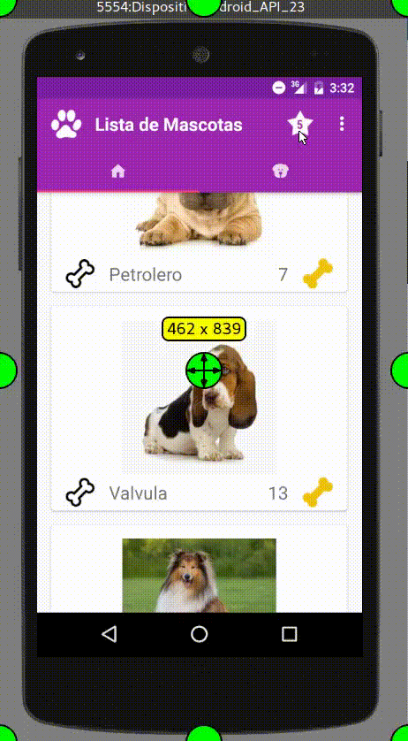

# Seman 4: Menus y Fragment
> - Menus: 
> - Fragmnet: Adapter, View Holder, Libreria CircularImageView
> - Java Mail: Libreria javamail

## Agregando Menus
- Crea un menú de opciones que muestre el Item “Contacto” y el Item “Acerca De” 

### Xml: Menu de Opciones 
```xml
    <menu
      xmlns:android="http://schemas.android.com/apk/res/android">
      <!-- Menu Contacto: Enviar Email -->
      <item android:id="@+id/mContacto"
          android:title="@string/menu_contacto"
          android:orderInCategory="100">
      </item>
      <!-- Menu About: Bio del Desarrollador -->
      <item android:id="@+id/mAbout"
          android:title="@string/menu_about"
          android:orderInCategory="101">
      </item>
    </menu>
```
### Java: Creamos un menú a nuestra aplicacion Principal.
````java
public class ListaMascotas extends AppCompatActivity {
    @Override
    public boolean onCreateOptionsMenu(Menu menu) {
        getMenuInflater().inflate(R.menu.menu_opciones,menu);
        return true;
    }
    @Override
    public boolean onOptionsItemSelected(MenuItem item) {
        switch (item.getItemId()){
            case R.id.mContacto:
                Intent intent1 = new Intent(this, Contacto.class);
                startActivity(intent1);
                break;
            case R.id.mAbout:
                Intent intent2 = new Intent(this, About.class);
                startActivity(intent2);
                break;
        }return super.onOptionsItemSelected(item);
    }
}
````
### Resultado


### Contacto deberá:
> - Llevarte a una pantalla con un formulario en el que solicites el nombre, el correo y su mensaje (utiliza los EditText de Material Design),
> - Además habrá un botón de “Enviar Comentario” el cual tomará la información recopilada y con ayuda de la librería JavaMail envíe un mail con el comentario del contacto.
- Contacto.java

````java
public class Contacto extends AppCompatActivity implements View.OnClickListener{

    EditText edtxtMail, edtxtNombre, edtxtMensaje;
    @Override
    protected void onCreate(Bundle savedInstanceState) {
        super.onCreate(savedInstanceState);
        setContentView(R.layout.activity_contacto);

        Button logign   =  (Button) findViewById(R.id.btnEviarMail);
        edtxtMail       = (EditText) findViewById(R.id.textEmail);
        edtxtNombre     = (EditText) findViewById(R.id.textNombre);
        edtxtMensaje    = (EditText) findViewById(R.id.textMensaje);

        logign.setOnClickListener(this);
    }

    public void irHome (View v){finish();}

    public void enviarEmail (View v){
        EnviarMail send = new EnviarMail(this, edtxtMail.getText().toString().trim(),
                                               edtxtNombre.getText().toString().trim(),
                                               edtxtMensaje.getText().toString().trim());
        send.execute();
    }
    @Override
    public void onClick(View v) {
        enviarEmail(v);
    }
}
````

